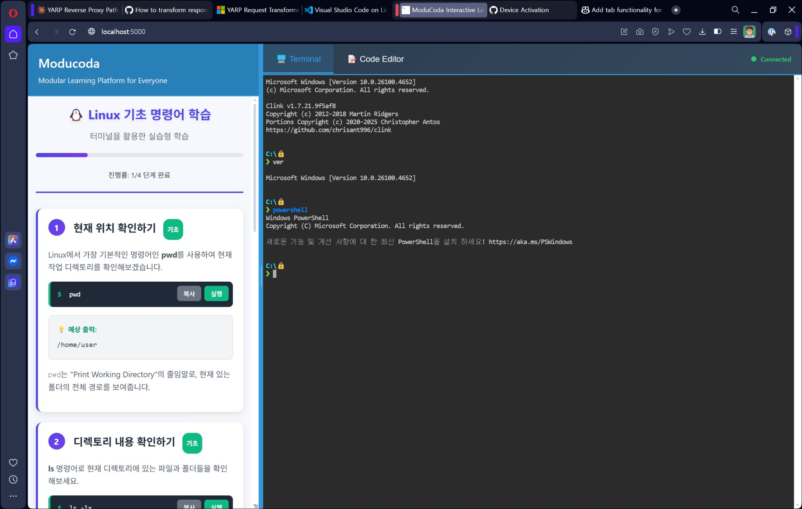

# ModuCoda - Interactive Learning Environments

Making interactive learning accessible to everyone, everywhere. 🚀

> Note: This project is still in early development. Significant changes to the code may occur frequently without notice.

**ModuCoda** is an open-source, cross-platform interactive learning environment that provides the frontend functionality similar to KataCoda and KillerCoda. It serves as a YARP-based reverse proxy that integrates with external services like ttyd (web terminal) and VS Code tunnel to create seamless interactive tutorials, coding exercises, and hands-on learning experiences across Windows, macOS, and Linux platforms.

## Single-Course Container Image

이 애플리케이션은 하나의 Docker 이미지 안에 하나의 학습 코스를 포함하는 사용 패턴을 지원합니다. 기본적으로 `src/ModuCoda/wwwroot/content/index.json`이 존재하면 `/instructions` 페이지가 해당 코스를 자동 로드하여 단계별 안내를 제공합니다.

- 코스 교체: 이미지 빌드 시 `wwwroot/content` 폴더의 파일들을 원하는 코스로 교체하세요.
- 다중 코스가 필요 없다면 쿼리 파라미터 없이 `/instructions`만 접근하면 됩니다.

## 🚀 Features

- **YARP Reverse Proxy**: High-performance reverse proxy using Microsoft's YARP (Yet Another Reverse Proxy)
- **Service Integration**: Seamlessly integrates with ttyd and VS Code tunnel services
- **Cross-Platform Support**: Runs natively on Windows, macOS, and Linux
- **Interactive Terminal**: Web-based terminal access via ttyd integration
- **Code Editor Integration**: VS Code tunnel integration for full IDE experience
- **Docker Support**: Container-ready deployment with Docker
- **Responsive Design**: Modern, mobile-friendly web interface with resizable panels
- **Real-time Execution**: Execute commands and see results instantly through integrated services
- **Educational Templates**: Pre-built interactive learning content

## 🏗️ Architecture

ModuCoda acts as a central hub that proxies requests to various backend services:

- **Core**: ASP.NET Core with YARP reverse proxy
- **Terminal Service**: ttyd (external service) for web-based terminal access
- **Code Editor**: VS Code tunnel (external service) for development environment
- **Frontend**: Modern HTML5/CSS3/JavaScript with responsive layout
- **Health Checks**: Built-in health monitoring for all integrated services
- **Containerization**: Docker support for easy deployment

## 🔧 Prerequisites

- [.NET 9.0 SDK](https://dotnet.microsoft.com/download/dotnet/9.0) or later
- [ttyd](https://github.com/tsl0922/ttyd) (for terminal functionality)
- Any kinds of [Visual Studio Code](https://code.visualstudio.com/)-based editor with tunnel support

## 🎯 Usage

### Quick Start

1. **Start Backend Services**: Run `launch_backend.cmd` to start ttyd and VS Code tunnel
2. **Launch ModuCoda**: Run `dotnet run` in the ModuCoda directory
3. **Open Browser**: Navigate to `http://localhost:5000`
4. **Start Learning**: Follow the interactive instructions in the left panel

### Interface Overview

- **Left Panel**: Interactive learning instructions and tutorials
- **Right Panel**: Tabbed interface with:
  - **Terminal Tab**: Web-based terminal via ttyd
  - **Code Editor Tab**: Full VS Code experience via tunnel
- **Resizable Layout**: Drag the divider to adjust panel sizes
- **Responsive Design**: Adapts to different screen sizes

### Supported Learning Scenario Examples

- **Linux/Unix Command Line**: Basic to advanced shell commands
- **Programming Languages**: Python, JavaScript, C#, and more
- **DevOps Tools**: Docker, Kubernetes, CI/CD pipelines
- **System Administration**: File management, process control, networking
- **Development Workflows**: Git, package managers, build tools

## 🛠️ Configuration

The application can be configured through:

- **appsettings.json**: Basic application settings
- **Environment Variables**: Runtime configuration
- **Docker Environment**: Container-specific settings

### Service Configuration

- **ttyd**
  - For Windows: `ttyd --interface 127.0.0.1 --port 7681 --cwd %SYSTEMDRIVE%\ --writable %COMSPEC%`
  - In General: `ttyd --interface 127.0.0.1 --port 7681 --writable /bin/bash`
- **VS Code**
  - In General: `code-tunnel.exe serve-web --host 127.0.0.1 --port 8000 --without-connection-token --accept-server-license-terms --server-base-path vscode`

## 🤝 Contributing

We welcome contributions from the community! Here's how you can help:

1. **Fork the repository**
2. **Create a feature branch**: `git checkout -b feature/amazing-feature`
3. **Make your changes** and add tests if applicable
4. **Commit your changes**: `git commit -m 'Add amazing feature'`
5. **Push to the branch**: `git push origin feature/amazing-feature`
6. **Open a Pull Request**

### Development Guidelines

- Follow C# coding conventions
- Add unit tests for new features
- Update documentation as needed
- Ensure cross-platform compatibility
- Test proxy configurations thoroughly

## 📋 Roadmap

- [ ] **Plugin System**: Extensible architecture for custom learning modules
- [ ] **User Management**: Authentication and progress tracking
- [ ] **Content Management**: CMS for creating and managing tutorials
- [ ] **Multi-language Support**: Internationalization (i18n)
- [ ] **Analytics Dashboard**: Learning progress and usage statistics
- [ ] **API Integration**: RESTful APIs for external system integration
- [ ] **Collaborative Features**: Multi-user sessions and sharing
- [ ] **Service Discovery**: Automatic detection of available backend services
- [ ] **Load Balancing**: Multiple backend service instances support

## 📄 License

ModuCoda is available under a **dual licensing model**:

Basically, this project is licensed under the GNU Affero General Public License v3.0 (AGPL-3.0) for open source use - see the [LICENSE](LICENSE) file for details.

For commercial deployments that require proprietary modifications or cannot comply with AGPL-3.0 requirements, a commercial license is available - see the [LICENSE-COMMERCIAL](LICENSE-COMMERCIAL) file for details.

| Use Case | Recommended License |
|----------|-------------------|
| Open source projects | AGPL-3.0 |
| Educational/Research use | AGPL-3.0 |
| Internal enterprise use with source sharing | AGPL-3.0 |
| Commercial SaaS without source disclosure | Commercial License |
| Integration into proprietary software | Commercial License |
| Redistribution in commercial products | Commercial License |

### Getting a Commercial License

For commercial licensing inquiries, please contact the project maintainers:

- **GitHub Issues**: [Create a licensing inquiry](https://github.com/rkttu/moducoda/issues/new?template=commercial-license.md)

We offer flexible commercial licensing terms based on your specific use case and requirements.

## 🙏 Acknowledgments

- **KataCoda & KillerCoda**: Inspiration for interactive learning environments
- **Microsoft YARP**: High-performance reverse proxy solution
- **ttyd**: Excellent web-based terminal implementation
- **VS Code**: Powerful development environment with tunnel support
- **ASP.NET Core**: Robust web framework foundation

## 🌟 Show Your Support

If you find ModuCoda helpful, please consider:

- ⭐ **Starring the repository**
- 🐛 **Reporting bugs and issues**
- 💡 **Suggesting new features**
- 🤝 **Contributing code or documentation**
- 📢 **Sharing with others who might benefit**
